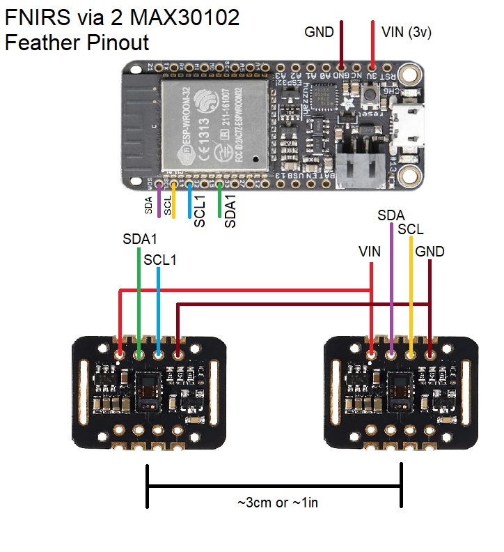
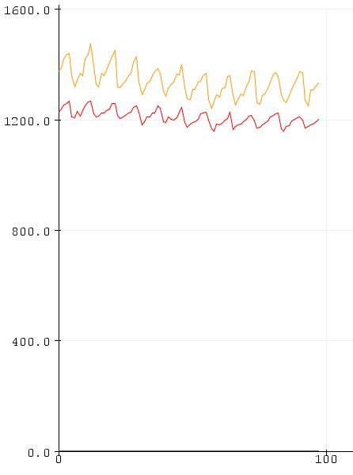

# HEGduino V0

This repo contains assembly and flashing instructions for a simplified and more accessible HEGduino design. I came up with the idea for this design a couple years ago but never got around to finishing it after my first attempt failed. This works fairly well but the sensor synchronization needs improvement: see [Known Issues](#known-issues)

### Requirements:

##### Hardware:

To use the full-featured BLE + WiFi + Bluetooh Classic + USB firmware in the HEGduino_V0 folder you may use any ESP32 development board.

To use the Dual_MAX30102_Test, any Arduino device with two (2) I2C ports available can be used, or if you know how to reprogram to use only one I2C lane - our example relies on TwoWire.

##### Software: 

[Arduino IDE](https://www.arduino.cc/en/Main/Software) with the espressif ESP32_Arduino libraries installed (easiest via the library manager)

Alt environment: [PlatformIO](https://platformio.org/) via VSCode

### Wiring:

Assemble your ESP32 and two MAX30102 devices like so, spacing hte MAX30102s apart about 3cm or 1in in a headband. Make sure you aren't contacting the pins on your skin or that will short circuit the sensor.

Any ESP32 will do, this demo was produced using the Feather ESP32 but we recommend the LOLIN32 clones as they can be flashed with a much lower power core clock of 80MHz instead of the full 240MHz the ESP32 is capable of, which we don't need.

The 2nd PPG device is used as the light sensor, and we attempt to sync the MAX30102 chips so that they may take simultaneous readings using only one set of LEDs. 

### Firmware: 

First [install the ESP32 tools for Arduino](https://docs.espressif.com/projects/arduino-esp32/en/latest/installing.html).
Follow steps accordingly for your OS. 

Copy the `libraries` in this repo into your `Documents/Arduino` folder, you may need to update the Async web server library.

If your USB port does not recognize the ESP32, you need to manually install the USB Drivers: [Download](https://www.silabs.com/products/development-tools/software/usb-to-uart-bridge-vcp-drivers) - these usually to come by default in your OS.

You need to select the correct board via the Boards menu and change the partition scheme to "Minimal SPIFFS" in the Arduino Tools menu before compiling and uploading to your ESP32. If available use the 80MHz CPU clock for lower power.

### 2nd PPG result through thumb:

### Headset Assembly (WIP)

Main thing is to use a ~3cm spacing and to pad foam between the PPG sensors so that there is minimal light interference through the forehead/scalp layer from the desired HEG signal. Otherwise you can mount it in a headset however. We will provide images and more description soon.

### Desktop/Mobile PWA

[Original](https://hegalomania.netlify.app)

[Brains@Play Demo](https://app.brainsatplay.com)

### Known Issues

The MAX30102 chips I am unable to correctly sync with interrupts or manual startup timing so far, so instead I am using the highest values between set intervals to report HEG values, which appears stable on the current configuration. This is something to be improved on but otherwise this beats the HEGduino V1.

MAX30102s have built in ambient light cancellation however, so when samples are desynchronized the second sensor reads the LED lights as ambient and reports zeros or the rising and falling edges of the LED pulses.

For now, to correct for this, we noticed uniform oscillations in the sampling values so between those intervals we select the maximum value as the peak LED power being read from the 2nd sensor. This works well enough at the right settings, but is not ideal as we'd rather have complete synchronization in order to keep samples. 

However, as you'll see below, the readings are good enough to resolve heart rhythm at about 10sps at the minimum stable sampling windows we could find, reduced from 1600/4 = 400sps effective sampling rate by the device, so the vast majority of samples are not able to be used in the current firmware while we just can just squeak by to get a usable FNIRS device. You are more than welcome to try and fix this issue as it would vastly improve the quality of this configuration.

Joshua Brewster

AGPL V3 License