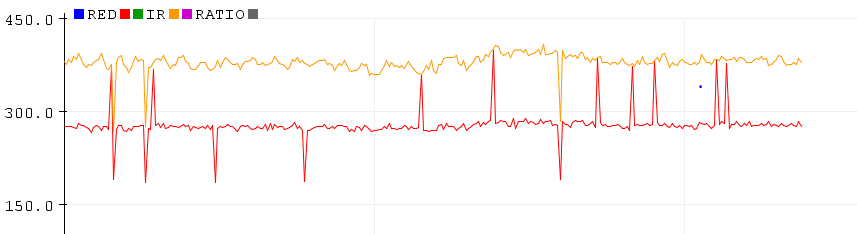
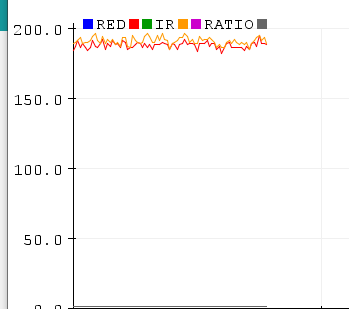
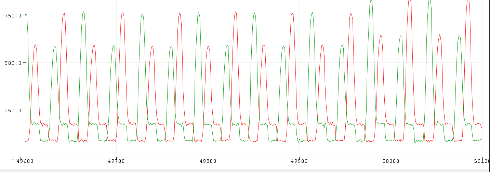

# HEGduino V0

This repo contains assembly and flashing instructions for a simplified and more accessible HEGduino design. This is by far the easiest solution while the original HEG_ESP32 repo was based off the expired patent for the original HEG. 

I came up with the idea for this design a couple years ago but never got around to finishing it after my first attempt failed. This works fairly well but the sensor synchronization needs improvement: see [Known Issues](#known-issues)

The current firmware manages about 20sps using some tricks to sample between both PPGs where they have automatic microsecond LED pulses that subtract ambient light from subsequent readings between pulses. We can improve this with better firmware but this is what we could do 

### Requirements:

- ESP32 Development Board
- 2 MAX30102 breakout boards ($1-$5), MAX30100 or MAX30105 also work.
- Arduino IDE

##### Hardware:

To use the full-featured BLE + WiFi (including a little webapp) + Bluetooth Classic + USB firmware in the HEGduino_V0 folder you may use any ESP32 development board. We prefer the LOLIN32 clones ($4-$5) or otherwise use the Adafruit Feather if you don't trust them ($20).

To use the Dual_MAX30102_Test, any Arduino device with two (2) I2C ports available can be used, or if you know how to reprogram to use only one I2C lane - our example relies on TwoWire.

##### Software: 

[Arduino IDE](https://www.arduino.cc/en/Main/Software) with the espressif ESP32_Arduino libraries installed (easiest via the library manager)

Alt environment: [PlatformIO](https://platformio.org/) via [VSCode](https://code.visualstudio.com/)

### Wiring:

Assemble your ESP32 and two MAX30102 devices like so, spacing the MAX30102s apart about 3cm or 1in in a headband. Make sure you aren't contacting the pins on your skin or that will short circuit the sensor.

Any ESP32 will do, this demo was produced using the Adafruit Feather ESP32 board but we recommend the LOLIN32 clones as they can more easily be flashed with a much lower power core clock of 80MHz instead of the full 240MHz the ESP32 is capable of, which we don't need.

The 2nd PPG device is used as the light sensor, and we attempt to sync the MAX30102 chips so that they may take simultaneous readings using only one set of LEDs. 

### Firmware: 

First [install the ESP32 tools for Arduino](https://docs.espressif.com/projects/arduino-esp32/en/latest/installing.html).
Follow steps accordingly for your OS. 

Copy the `libraries` in this repo into your `Documents/Arduino` folder, you may need to update the Async web server library.

If your USB port does not recognize the ESP32, you need to manually install the USB Drivers: [Download](https://www.silabs.com/products/development-tools/software/usb-to-uart-bridge-vcp-drivers) - these usually come by default in your OS.

You need to select the correct board via the Boards menu and change the partition scheme to "Minimal SPIFFS" in the Arduino Tools menu before compiling and uploading to your ESP32. If available use the 80MHz CPU clock for lower power.

### 2nd PPG result through thumb:

### HEG result (some artifacts from low light level)

Heart rate pulse ought to be visible in the infrared range, but this is only possible if the readings are strong enough. You can move the sensors in to about 2.3cm apart minimum before you are reading more scalp PPG than FNIRs signal if you need to make the signal stronger. 

### Ambient comparison

### Headset Assembly (WIP)

Main thing is to use a 2.3-3cm spacing and to pad foam between the PPG sensors so that there is minimal light interference through the forehead/scalp layer from the desired brain blood flow signal, or what we could call "depth pulse oximetry" in this case using two actual PPG devices, which is the same thing. We will provide images and more description soon of a headset.

Make sure the PPGs are not angled away from each other or you will only see ambient light readings. The firmware also assumes the red LED is brighter so you may need to adjust the pulse amplitude down if it is overpowering the IR LED, which is more likely at lower sensor reading levels. 

### Desktop/Mobile PWA

[Original](https://hegalomania.netlify.app)

[Brains@Play Demo](https://app.brainsatplay.com)

### Known Issues

LED raw samples are not synced so we are compensating by selecting peaks manually based on observed characteristics:

##### Raw readings before selecting peaks

I can't seem to sync the sampling periods between both devices, and other sequences in your firmware will change the nature of the synchronization here. To compensate we are selecting peaks between sampling periods and noticing that the red LED is usually reading out a lower value, which we can guarantee by lowering the power level on the Red LED. 

Note the black MAX30102 breakout boards have reversed Red and Infrared positions from the sparkfun library spec but our little algorithm compensates automatically for that regardless of which MAX board you are using. Note that however when you want to change the pulse amplitude using the sparkfun library.

Joshua Brewster

AGPL V3 License